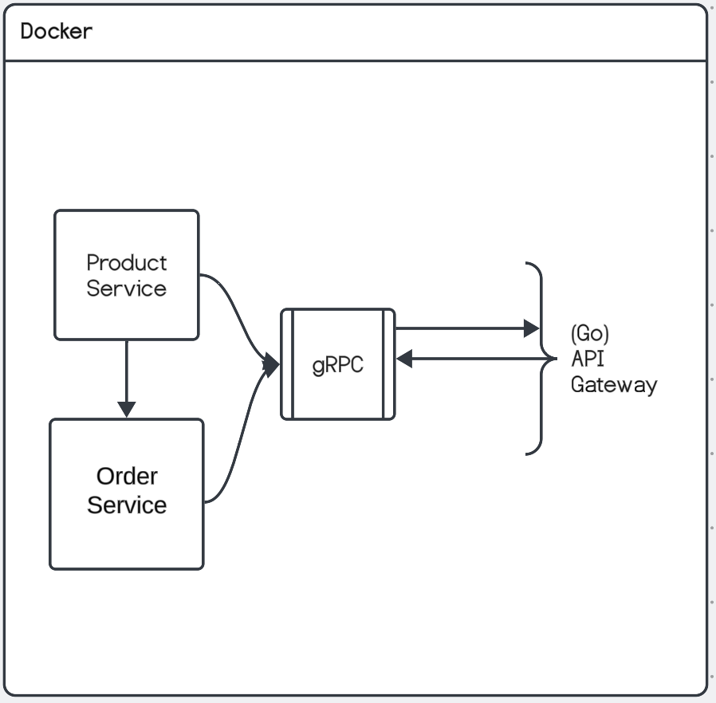

# Kingtide Microservices

## Overview

This project demonstrates a microservices architecture using gRPC, NestJS, and Golang as an API gateway. It includes a Product Service and an Order Service, both implemented in NestJS, and an API Gateway implemented in Golang.

## Project Structure

- **proto/**: Contains the gRPC proto files.
- **product-service/**: Contains the NestJS product service.
- **order-service/**: Contains the NestJS order service.
- **api-gateway/**: Contains the Golang API gateway.
- **docs/**: Contains documentation files.
```
kingtide-coding/
├── proto/
│   ├── product.proto
│   └── order.proto
├── product-service/
│   ├── src/
│   │   ├── main.ts
│   │   ├── app.module.ts
│   │   ├── product.controller.ts
│   │   ├── product.service.ts
│   │   └── interfaces/
│   │       └── product.interface.ts
│   ├── test/
│   ├── package.json
│   └── Dockerfile
├── order-service/
│   ├── src/
│   │   ├── main.ts
│   │   ├── app.module.ts
│   │   ├── order.controller.ts
│   │   ├── order.service.ts
│   │   └── interfaces/
│   │       └── order.interface.ts
│   ├── test/
│   ├── package.json
│   └── Dockerfile
├── api-gateway/
│   ├── main.go
│   ├── Dockerfile
│   ├── go.mod
│   └── go.sum
├── docker-compose.yml
├── README.md
```
## Setup and Running the Project

### Prerequisites

- Docker and Docker Compose
- Node.js and npm
- Go

### Steps to Run the Project

1. **Clone the repository**

    ```sh
    git clone https://github.com/yourusername/your-repo-name.git
    cd your-repo-name
    ```

2. **Build and Run using Docker Compose**

    ```sh
    docker-compose up --build
    ```

   This command will build and start all the services (Product Service, Order Service, and API Gateway).

3. **Access the Services**

   - Product Service: `localhost:50051` (gRPC)
   - Order Service: `localhost:50052` (gRPC)
   - API Gateway: `localhost:8080` (REST)

## API Documentation

Detailed API documentation is available in the [docs/api-documentation.md](docs/api-documentation.md) file. A Postman collection is also included for testing the REST API.

## Architecture



## Security

The API Gateway implements JWT authentication to secure the endpoints. Please refer to the [api-gateway/main.go](api-gateway/main.go) for the implementation details.

## Unit Tests

Unit tests are included in the respective services. You can run them using the following commands:

- **Product Service**:

    ```sh
    cd product-service
    npm test
    ```

- **Order Service**:

    ```sh
    cd order-service
    npm test
    ```
